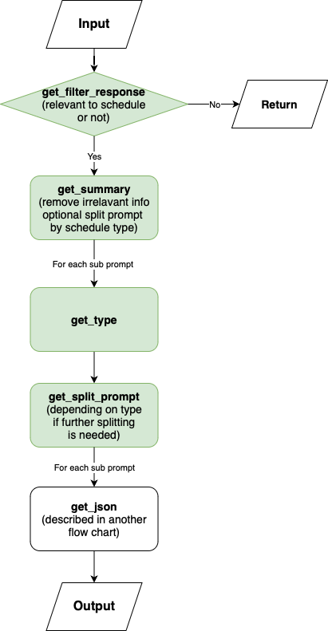
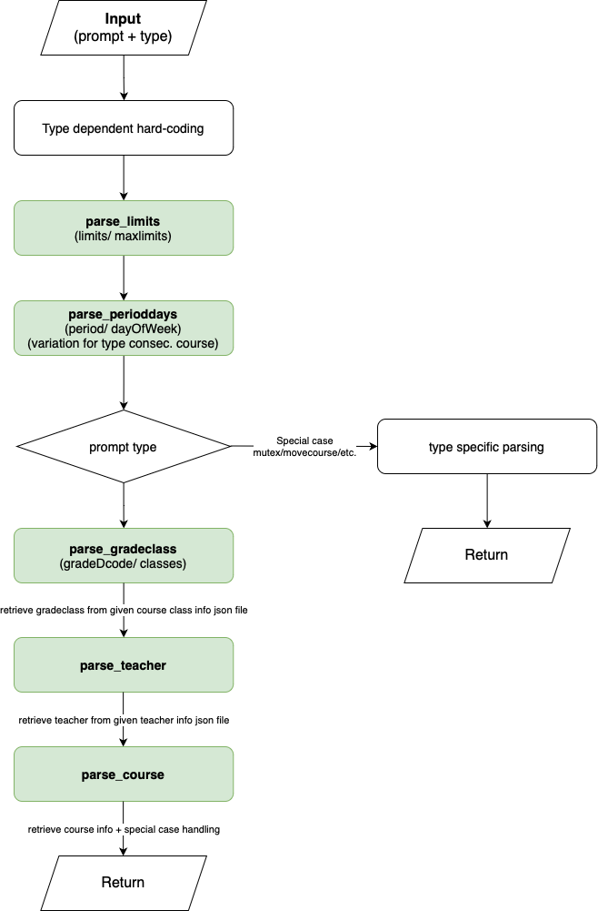
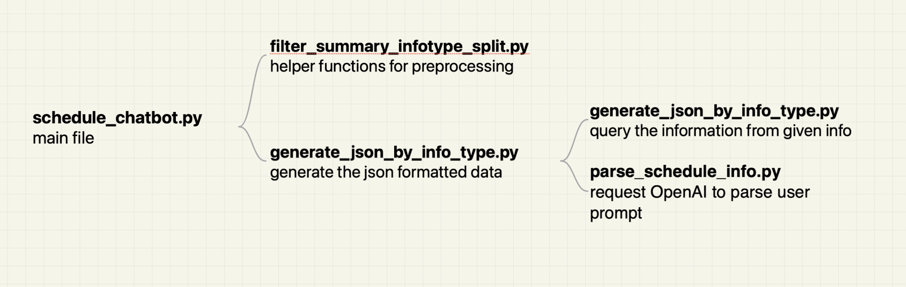

# ai_assistant

## Dependencies:

python 3.12.5

pandas  2.2.2

openai 1.40.1

dotenv 

pydantic 2.8.2

## Usage

To get started, please open `config.py` file and enter your OpenAI API Key:
```python
openai_api_key = "<Please_enter_your_OpenAIKey_here>"
```
Up to your demand, you can also change the input json information files, model name and temperature there.

Before run, prepare your course scheduling information and put it in `inputs/input_info.json`
```bash
{
    "input_info" : "<Your_course_scheduling_information_here>"
}
```

And then, step into `./source/` and you can run:
```bash
python3 schedule_chatbot.py
```

## Testing

Design test inputs and store it in `./tests/test_inputs/`
```json
{
    "input_info": "初一初二初三语文 连堂1次 放在周三或周四的下午"
}
```

Add you desired output to `./tests/test_expected_outputs/`.

Add a new test case to `./source/test_schedule_chatbot.py` with the following structure:
```
def test_<name>(self):
    input_name = "<input_filename>"
    actual_output_name = "<output_filename>"
    expected_output_name = "<golden_filename>"
    expected_json, actual_json = run_and_compare_helper(input_name, actual_output_name, expected_output_name)
    self.assertEqual(expected_json, actual_json)
```

Then, in terminal, from `./source/` folder, run:
```bash
python3 ./schedule_chatbot.py
```

## Code Flowchart

> **Remarks**
>
> Processes in green utilizes LLM for information parsing

### Main code (schedule_chatbot.py) flow chart
<div style="text-align: center;">

</div>

### Get JSON (generate_json_by_info_type.py) flow chart
<div style="text-align: center;">

</div>

## File Structure


## TODO's:
- [ ] if teacher time, do an extra check if a teacher exists in the prompt
- [ ] Fix limit information